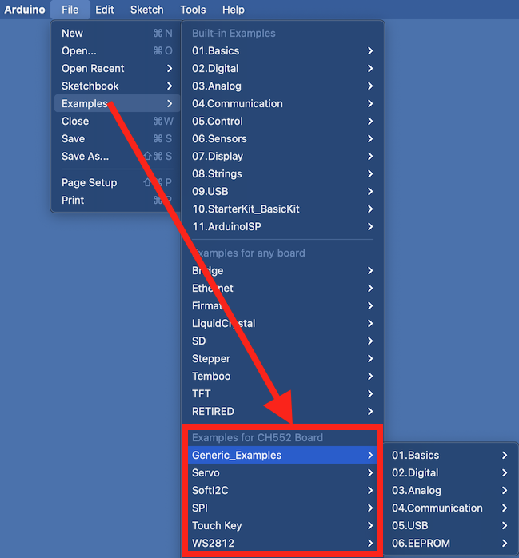

# CH55xduino Documentation

CH55xduino is an Arduino-compatible board support package (BSP) for WCH CH55x series microcontrollers. This documentation provides comprehensive information about setting up and using CH55xduino.

## Table of Contents
1. [Introduction](#introduction)
2. [Installation](#installation)
3. [Supported Hardware](#supported-hardware)
4. [Getting Started](#getting-started)
5. [Programming Reference](#programming-reference)
6. [Tools and Utilities](#tools-and-utilities)

## Introduction

CH55xduino enables Arduino-style programming for CH55x series microcontrollers, which are 8051-core USB-capable MCUs. The project provides:
- Arduino-compatible development environment
- USB bootloader support
- Core libraries for CH55x peripherals
- Examples and documentation

## Installation

### Method 1: Using Arduino Board Manager
1. Open Arduino IDE
2. Go to File → Preferences
3. Add the following URL to "Additional Boards Manager URLs":
   ```
   https://raw.githubusercontent.com/DeqingSun/ch55xduino/master/package_ch55xduino_mcs51_index.json
   ```
4. Go to Tools → Board → Boards Manager
5. Search for "CH55x" and install the package

### Method 2: Manual Installation
1. Create a hardware directory in your Arduino folder if it doesn't exist
2. Clone the repository:
   ```bash
   mkdir -p ~/Arduino/hardware/ch55xduino
   cd ~/Arduino/hardware/ch55xduino
   git clone https://github.com/DeqingSun/ch55xduino.git
   ```
3. Restart Arduino IDE

## Supported Hardware

The CH55xduino BSP supports several microcontrollers from the CH55x family:

- **CH551**: Entry-level USB microcontroller
  - 10-bit ADC
  - 16KB Flash
  - USB Device

- **CH552**: Enhanced USB microcontroller
  - 12-bit ADC
  - 16KB Flash
  - USB Device
  - Enhanced peripherals

- **CH559**: Advanced USB microcontroller (experimental)
  - 12-bit ADC
  - 64KB Flash
  - USB Host/Device
  - Advanced peripherals

- **CH549**: Extended features (experimental)
  - Additional features for power delivery applications

For detailed hardware documentation of the Johnny552 development board, please see [Johnny552 Hardware Documentation](johnny522_HardwareDocumentation.md).

## Getting Started

### Finding Examples

The CH55xduino package comes with several example sketches to help you get started. You can find them in the Arduino IDE:



Check out our detailed example guides:
- [Blink LED Example](examples/Blink_LED_Example.md) - The classic LED blink example with demonstration

### Setting Up Your First Project

1. **Select Your Board**
   - Tools → Board → CH55xDuino
   - Select your specific board model

2. **Configure Settings**
   - USB Settings (if applicable)
   - Clock Speed
   - Upload Method

3. **Basic Example**
   ```cpp
   void setup() {
     pinMode(LED_BUILTIN, OUTPUT);
   }

   void loop() {
     digitalWrite(LED_BUILTIN, HIGH);
     delay(1000);
     digitalWrite(LED_BUILTIN, LOW);
     delay(1000);
   }
   ```

### Uploading Code

1. **Enter Bootloader Mode**
   - Hold BOOT button
   - Press RESET
   - Release BOOT

2. **Upload from Arduino IDE**
   - Click Upload button or press Ctrl+U/Cmd+U

## Programming Reference

### Core Functions

- **Digital I/O**
  - `pinMode(pin, mode)`
  - `digitalWrite(pin, value)`
  - `digitalRead(pin)`

- **Analog I/O**
  - `analogRead(pin)`
  - `analogWrite(pin, value)`

- **USB Functions**
  - `USBInit()`
  - `CDC_print()`
  - `USB_Suspend()`

### Interrupts and Timers

- Timer0/Timer1/Timer2 support
- External interrupts
- USB interrupts

## Tools and Utilities

### CH55x Specific Tools

1. **Bootloader Tools**
   - Located in `/tools` directory
   - Used for firmware updates

2. **File Packer**
   - Located in `/filePacker`
   - Helps package files for upload

### Development Tips

1. **Memory Management**
   - 8051 architecture specifics
   - RAM limitations and optimization

2. **USB Development**
   - Device descriptors
   - Endpoint configuration
   - CDC/HID implementations

## Additional Resources

- [Official Repository](https://github.com/DeqingSun/ch55xduino)
- [WCH Official Documentation](http://www.wch.cn/)
- [Community Forums](https://github.com/DeqingSun/ch55xduino/issues)

## Troubleshooting

### Common Issues

1. **Upload Problems**
   - Verify bootloader mode
   - Check USB connection
   - Verify driver installation

2. **Compilation Errors**
   - Check SDCC version compatibility
   - Verify memory usage
   - Check syntax for 8051 specifics

### Getting Help

- Open issues on GitHub
- Check existing issues for solutions
- Join community discussions

## License

This project is licensed under open-source terms. See LICENSE file for details.
