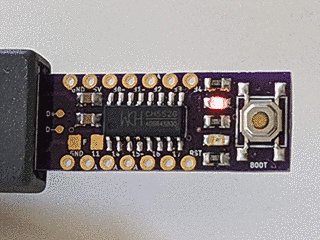

# Blink LED Example

This example demonstrates the most basic functionality of the CH55x board by blinking the built-in LED. It's the "Hello World" of microcontroller programming!

## Demo



## Code

```cpp
// Blink LED Example for CH55x
// This example blinks the built-in LED on the development board

void setup() {
    pinMode(LED_BUILTIN, OUTPUT);    // Set the LED pin as output
}

void loop() {
    digitalWrite(LED_BUILTIN, HIGH); // Turn on the LED
    delay(1000);                    // Wait for 1 second
    digitalWrite(LED_BUILTIN, LOW);  // Turn off the LED
    delay(1000);                    // Wait for 1 second
}
```

## How It Works

1. `setup()` runs once when the board starts:
   - Configures the built-in LED pin as an output using `pinMode()`

2. `loop()` runs repeatedly:
   - Turns the LED on with `digitalWrite(HIGH)`
   - Waits 1 second with `delay(1000)`
   - Turns the LED off with `digitalWrite(LOW)`
   - Waits another second

## Hardware Required

- Any CH55x development board (the example shows CH552)
- USB cable for power

## Notes

- `LED_BUILTIN` is a predefined constant that represents the pin number of the built-in LED
- The actual pin number may vary depending on your board variant
- The LED polarity might be different on some boards (some LEDs are active-low)

## Troubleshooting

If the LED doesn't blink:
1. Verify the board is properly powered
2. Check if you've selected the correct board in Arduino IDE
3. Make sure the bootloader is properly installed
4. Verify the LED is not damaged

## Variations

You can modify the blink pattern by changing the delay values:
```cpp
// Faster blinking
delay(500);  // Half second delays

// Or create patterns
digitalWrite(LED_BUILTIN, HIGH);
delay(200);  // Short on
digitalWrite(LED_BUILTIN, LOW);
delay(800);  // Long off
```
