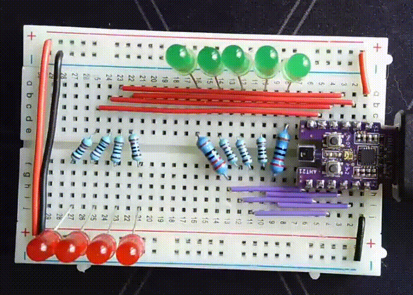
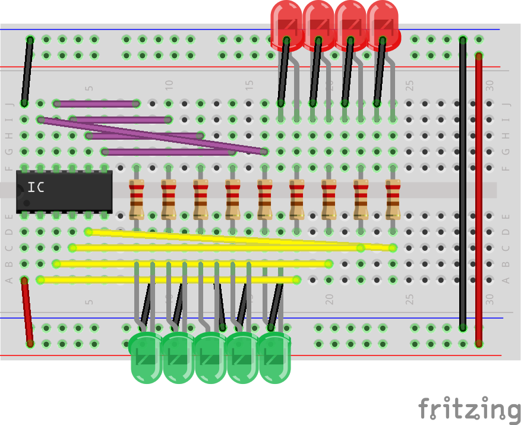

# Johnny552 Pin Test Example

This example demonstrates how to test multiple GPIO pins on the Johnny552 board using LEDs. The test program cycles through a series of green and red LEDs connected to specific pins to verify proper GPIO functionality.



## Hardware Requirements

- 1× Johnny552 development board
- 5× Green LEDs
- 4× Red LEDs
- 9× 220Ω resistors (one for each LED)
- Breadboard
- Jumper wires

## Circuit Diagram

The circuit consists of:

- 5 green LEDs connected to pins 7, 8, 9, 10, and 11
- 4 red LEDs connected to pins 2, 3, 4, and 5

Each LED is connected with its anode (longer leg) to the GPIO pin through a 220Ω current-limiting resistor, and its cathode (shorter leg) to ground (GND).



## How It Works

The example program sequentially tests two sets of GPIO pins:

1. **Green LEDs (Pins 7-11)**: Lights up in sequence from pin 7 to pin 11 ("going up")
2. **Red LEDs (Pins 2-5)**: Lights up in reverse sequence from pin 5 to pin 2 ("going down")

Each LED turns on for 200 milliseconds, then turns off before the next LED in the sequence activates. After completing the green LED sequence, there's a 1-second pause before starting the red LED sequence.

## Code Explanation

```cpp
// LED test program for Johnny552 board
// Tests 5 green LEDs (pins 7-11) and 4 red LEDs (pins 2-5)

// Define pins for green LEDs (going "up")
const int greenLED_pins[] = {7, 8, 9, 10, 11};  // 5 green LEDs
const int greenLED_count = 5;

// Define pins for red LEDs (going "down")
const int redLED_pins[] = {2, 3, 4, 5};  // 4 red LEDs
const int redLED_count = 4;

void setup() {
  // Set all LED pins as outputs and start LOWgit merge 
  
  // Initialize green LEDs
  for (int i = 0; i < greenLED_count; i++) {
    pinMode(greenLED_pins[i], OUTPUT);
    digitalWrite(greenLED_pins[i], LOW);
  }
  
  // Initialize red LEDs
  for (int i = 0; i < redLED_count; i++) {
    pinMode(redLED_pins[i], OUTPUT);
    digitalWrite(redLED_pins[i], LOW);
  }
  
  delay(100);  // Short delay to ensure pins are set
}

void loop() {
  // Green LEDs go "up" (pins 7 to 11)
  for (int i = 0; i < greenLED_count; i++) {
    // Turn on current green LED
    digitalWrite(greenLED_pins[i], HIGH);
    delay(200);  // Wait 0.2 seconds between each LED
    digitalWrite(greenLED_pins[i], LOW);  // Turn off current LED before moving to next
  }
  
  delay(1000);  // Wait 1 second after all green LEDs
  
  // Red LEDs go "down" (pins 5 to 2)
  for (int i = redLED_count - 1; i >= 0; i--) {
    // Turn on current red LED
    digitalWrite(redLED_pins[i], HIGH);
    delay(200);  // Wait 0.2 seconds between each LED
    digitalWrite(redLED_pins[i], LOW);  // Turn off current LED before moving to next
  }
  
  delay(200);  // Small delay before starting the sequence again
}
```

## Key Concepts

1. **Pin Configuration**: The example demonstrates how to configure multiple GPIO pins as outputs.
2. **Array Usage**: Arrays are used to store pin numbers, making the code more organized and easier to modify.
3. **Sequential Control**: The code shows how to create sequential lighting patterns with precise timing.
4. **Loop Direction**: The green LEDs sequence runs forward (ascending pin numbers), while the red LEDs sequence runs backward (descending pin numbers).

## Expected Behavior

When the program runs correctly:

1. The green LEDs will light up one by one from left to right (pins 7→11)
2. After a 1-second pause, the red LEDs will light up one by one from right to left (pins 5→2)
3. The sequence repeats continuously

## Troubleshooting

If the LEDs don't light up as expected:

1. **Check Connections**: Verify all LEDs are connected to the correct pins with the correct polarity
2. **Check Resistors**: Ensure each LED has a current-limiting resistor
3. **Test Individual Pins**: Try a simple program that turns on just one LED at a time to isolate issues
4. **Verify Board Selection**: Make sure you've selected the Johnny552 board in the Arduino IDE

## Extending the Example

Here are some ways to modify this example:

1. **Change Timing**: Adjust the delay values to create different lighting patterns
2. **Add Patterns**: Implement more complex lighting sequences (e.g., alternating, random, or fading patterns)
3. **Use PWM**: For pins that support PWM, try using `analogWrite()` to create brightness variations
4. **Add User Input**: Use a button to change between different lighting patterns

## Related Examples

- [Blink LED Example](Blink_LED_Example.md) - Basic LED control
