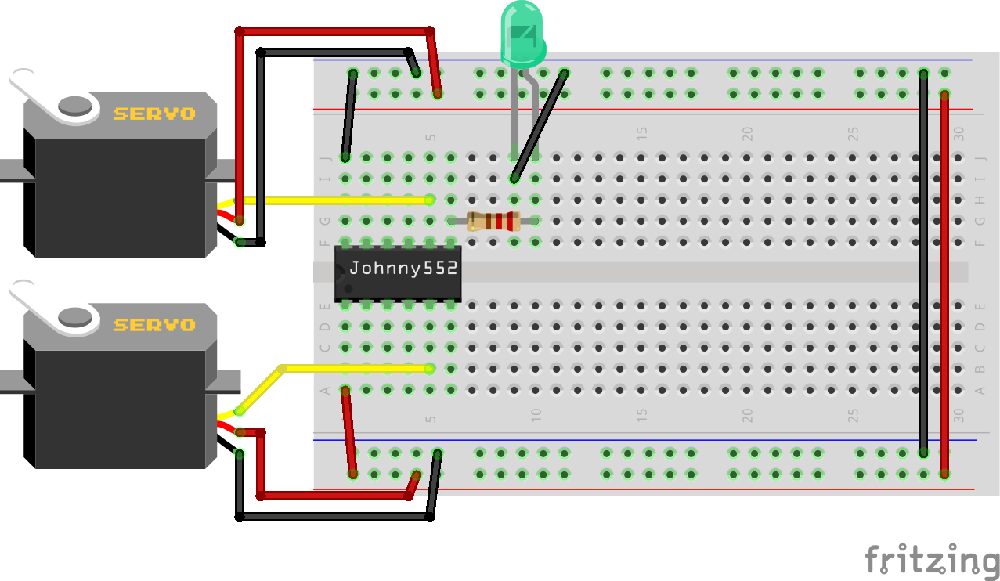

# Johnny552 Servo Control Example

This example demonstrates how to control a standard hobby servo motor using the Johnny552 board's PWM capabilities. The servo will sweep back and forth through its full range of motion, showing how to use the Servo library with the Johnny552 board.


## Hardware Requirements

- 1× Johnny552 development board
- 1× Standard hobby servo motor (e.g., SG90, MG996R)
- Jumper wires
- 5V external power supply (recommended for larger servos)

## Circuit Diagram

The circuit consists of:

- Servo signal wire (usually orange or yellow) connected to pin 5 (PWM1)
- Servo power wire (usually red) connected to 5V
- Servo ground wire (usually brown or black) connected to GND



> **Note:** For larger servos that draw more current, use an external 5V power supply connected to the servo's power wire, with the grounds of the power supply and Johnny552 connected together.

## Test Procedure

When you upload and run this example:

1. The servo will first move to its center position (90°)
2. After a brief pause, it will sweep from 0° to 180° in 5° increments
3. Then it will sweep back from 180° to 0° in 5° increments
4. The sequence repeats continuously

This test verifies that:
- The Johnny552 can generate proper PWM signals for servo control
- The servo responds correctly to position commands
- The connections between the board and servo are correct

## Code Explanation

```cpp
// Servo control example for Johnny552 board
// Uses PWM pin 5 to control a standard hobby servo

#include <Servo.h>

Servo myservo;  // Create servo object to control a servo

const int servoPin = 5;  // PWM pin 5 (P1.5) for servo control
int pos = 0;             // Variable to store the servo position

void setup() {
  // Attach the servo to the specified pin
  myservo.attach(servoPin);
  
  // Move to center position and wait
  myservo.write(90);
  delay(1000);
}

void loop() {
  // Sweep from 0 to 180 degrees
  for (pos = 0; pos <= 180; pos += 5) {
    myservo.write(pos);  // Tell servo to go to position
    delay(50);          // Wait for the servo to reach the position
  }
  
  delay(500);  // Pause at maximum position
  
  // Sweep from 180 to 0 degrees
  for (pos = 180; pos >= 0; pos -= 5) {
    myservo.write(pos);  // Tell servo to go to position
    delay(50);          // Wait for the servo to reach the position
  }
  
  delay(500);  // Pause at minimum position
}
```

## Key Concepts

1. **Servo Library**: The example uses the standard Arduino Servo library, which is compatible with the Johnny552 board.
2. **PWM Control**: Servos are controlled by sending precise PWM (Pulse Width Modulation) signals, which the Johnny552 can generate on its PWM-capable pins.
3. **Angle Control**: The `write()` function sets the servo angle between 0° and 180°.
4. **Timing**: Proper delays are important to allow the servo time to reach its target position.

## How Servos Work

Standard hobby servos operate based on PWM signals with the following characteristics:

- Pulse width of 1.0ms corresponds to 0° position
- Pulse width of 1.5ms corresponds to 90° position (center)
- Pulse width of 2.0ms corresponds to 180° position
- The pulse is typically repeated every 20ms (50Hz)

The Arduino Servo library handles these timing details automatically, converting angle values (0-180) to the appropriate pulse widths.

## Troubleshooting

If the servo doesn't move as expected:

1. **Check Connections**: Verify the signal wire is connected to the correct PWM pin (pin 5)
2. **Power Issues**: Ensure the servo has adequate power. The Johnny552's USB power might be insufficient for larger servos
3. **Servo Library**: Make sure the Servo library is properly installed
4. **Servo Limits**: Some servos may have mechanical limits that prevent full 0-180° rotation
5. **PWM Frequency**: If the servo jitters, the PWM frequency might need adjustment

## Extending the Example

Here are some ways to modify this example:

1. **Button Control**: Use the onboard button to change servo positions
2. **Multiple Servos**: Control multiple servos by attaching them to different PWM pins (8, 9, or 11)
3. **Smooth Movement**: Implement easing functions for smoother servo movement
4. **Position Feedback**: Add position feedback using the AHT21 sensor or other input
5. **Precise Timing**: Implement more precise timing control for specific applications

## Related Examples

- [PWM LED Example](pwm_led_example.md) - Basic PWM output control
- [Button Input Example](button_input_example.md) - Reading button inputs

## Notes on Power Requirements

Small servos like the SG90 typically draw around 100-250mA when moving, while larger servos can draw 1A or more. The Johnny552's USB power may be sufficient for small servos, but for reliable operation with larger servos, use an external 5V power supply.

When using an external power supply:
1. Connect the servo's power wire to the external 5V supply
2. Connect the grounds of the Johnny552 and the external power supply together
3. Connect only the signal wire from the Johnny552 to the servo