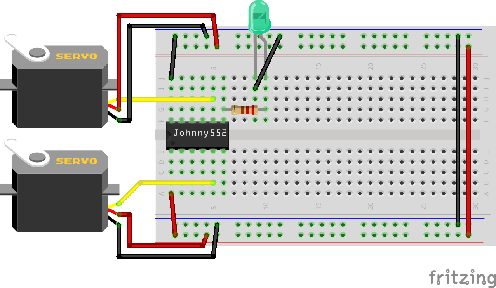

# Johnny552 Servo Control Example

This example demonstrates how to control multiple standard hobby servo motors using the Johnny552 board's PWM capabilities. The servos will cycle through various positions (0°, 90°, 180°), showing how to use the custom Servo library with the Johnny552 board.


## Hardware Requirements

- 1× Johnny552 development board
- 2× SG90 micro servo motors
- 1× LED (for visual feedback)
- 1× 220Ω resistor (for the LED)
- Jumper wires
- 5V external power supply (recommended when using multiple servos)

## Circuit Diagram

The circuit consists of:

- Servo 1 signal wire (usually orange or yellow) connected to pin 5 (P1.5 - PWM1)
- Servo 2 signal wire connected to pin 11 (P3.4 - PWM2)
- Servo power wires (usually red) connected to 5V
- Servo ground wires (usually brown or black) connected to GND
- LED connected to pin 7 (P1.1) through a 220Ω resistor, with the cathode (short leg) to GND



> **Note:** For larger servos that draw more current, use an external 5V power supply connected to the servo's power wire, with the grounds of the power supply and Johnny552 connected together.

## Test Procedure

When you upload and run this example:

1. The code will attempt to attach both servos and indicate success/failure with LED blinks
2. It will then alternate between testing each servo:
   - First servo 1, then servo 2, then back to servo 1, etc.
3. For each servo, it will cycle through these positions:
   - 0° (with LED on)
   - 90° (with LED off)
   - 180° (with LED on)
   - Back to 90° (with LED off)
4. The code will then switch to the other servo and repeat

This test verifies that:
- The Johnny552 can generate proper PWM signals for multiple servo control
- Both servos respond correctly to position commands
- The connections between the board and servos are correct
- The custom pulse width settings for SG90 servos work properly

## Code Explanation

```cpp
// Servo control example for Johnny552 board
// Uses PWM pins 5 and 11 to control two SG90 servos

#include <Servo.h>

// Pin definitions
#define LED_PIN 7  // P1.1 (D0) - LED for visual feedback

// Servo pins to test
const int servoPin1 = 5;  // P1.5 - PWM1
const int servoPin2 = 11; // P3.4 - PWM2
int activeServo = 1;      // Which servo is currently being tested (1 or 2)
int minPulseWidth = 544;  // SG90 optimal minimum pulse width
int maxPulseWidth = 2400; // SG90 optimal maximum pulse width

// Function prototypes (declarations)
void setupServos();
void switchActiveServo();

// Function to set up both servos
void setupServos() {
  // Configure pins as output
  pinMode(servoPin1, OUTPUT);
  pinMode(servoPin2, OUTPUT);
  
  // Try to attach both servos with custom pulse width range
  bool servo1Success = Servo_attachMinMax(servoPin1, minPulseWidth, maxPulseWidth);
  bool servo2Success = Servo_attachMinMax(servoPin2, minPulseWidth, maxPulseWidth);
  
  // Indicate success/failure with LED patterns
  if (servo1Success) {
    // Servo 1 success - one blink
    digitalWrite(LED_PIN, HIGH);
    delay(300);
    digitalWrite(LED_PIN, LOW);
    delay(300);
  } else {
    // Servo 1 error - two rapid blinks
    for (int i = 0; i < 2; i++) {
      digitalWrite(LED_PIN, HIGH);
      delay(100);
      digitalWrite(LED_PIN, LOW);
      delay(100);
    }
  }
  
  // Similar pattern for servo 2
  // ...
}

void setup() {
  // Initialize the servo library
  Servo_init();
  
  // Set up LED for visual feedback
  pinMode(LED_PIN, OUTPUT);
  
  // Configure and attach both servo pins
  setupServos();
}

void loop() {
  // Get the current active pin
  int currentPin = (activeServo == 1) ? servoPin1 : servoPin2;
  
  // Test angle control sequence
  digitalWrite(LED_PIN, HIGH);
  Servo_write(currentPin, 0);    // Move to 0 degrees
  delay(2000);
  
  digitalWrite(LED_PIN, LOW);
  Servo_write(currentPin, 90);   // Move to 90 degrees
  delay(2000);
  
  digitalWrite(LED_PIN, HIGH);
  Servo_write(currentPin, 180);  // Move to 180 degrees
  delay(2000);
  
  digitalWrite(LED_PIN, LOW);
  Servo_write(currentPin, 90);   // Return to center
  delay(2000);
  
  // Switch to the other servo
  switchActiveServo();
}
```

## Key Concepts

1. **Custom Servo Library**: The example uses the Johnny552's custom Servo library with C-style function calls.
2. **Multiple Servo Control**: The code demonstrates controlling multiple servos simultaneously.
3. **Optimized Pulse Widths**: Uses custom pulse width values (544-2400μs) optimized for SG90 servos.
4. **Angle Control**: The `Servo_write()` function sets the servo angle between 0° and 180°.
5. **Visual Feedback**: Uses the onboard LED to indicate which servo is active and what position it's moving to.

## How Servos Work

Standard hobby servos operate based on PWM signals with the following characteristics:

- For SG90 servos:
  - Pulse width of 0.544ms corresponds to 0° position
  - Pulse width of 1.5ms corresponds to 90° position (center)
  - Pulse width of 2.4ms corresponds to 180° position
- The pulse is typically repeated every 20ms (50Hz)

The custom Servo library handles these timing details automatically, converting angle values (0-180) to the appropriate pulse widths for each servo.

The Johnny552's custom Servo library handles these timing details automatically, converting angle values (0-180) to the appropriate pulse widths based on each servo's configured min/max values.

## Troubleshooting

If the servos don't move as expected:

1. **Check Connections**: Verify the signal wires are connected to the correct PWM pins (5 and 11)
2. **Power Issues**: Ensure the servos have adequate power. The Johnny552's USB power might be insufficient for multiple servos
3. **LED Feedback**: Watch the LED blink patterns to confirm if servo attachment was successful
4. **Pulse Width Range**: If servos grind or jitter, you may need to adjust the min/max pulse width values
5. **Servo Limits**: Some servos may have mechanical limits that prevent full 0-180° rotation

## Extending the Example

Here are some ways to modify this example:

1. **Button Control**: Use the onboard button to change servo positions or select which servo to control
2. **More Servos**: Add more servos (up to 8 total with the current library)
3. **Smooth Movement**: Implement easing functions for smoother servo movement between positions
4. **Synchronized Movement**: Create patterns where both servos move in coordination
5. **Different Servo Types**: Use the `Servo_attachMinMax()` function to support different servo models with their own pulse width requirements
6. **Position Feedback**: Add position feedback using the AHT21 sensor or other input

## Related Examples

- [PWM LED Example](pwm_led_example.md) - Basic PWM output control
- [Button Input Example](button_input_example.md) - Reading button inputs

## Notes on Power Requirements

Small servos like the SG90 typically draw around 100-250mA when moving, while larger servos can draw 1A or more. The Johnny552's USB power may be sufficient for small servos, but for reliable operation with larger servos, use an external 5V power supply.

When using an external power supply:
1. Connect the servo's power wire to the external 5V supply
2. Connect the grounds of the Johnny552 and the external power supply together
3. Connect only the signal wire from the Johnny552 to the servo