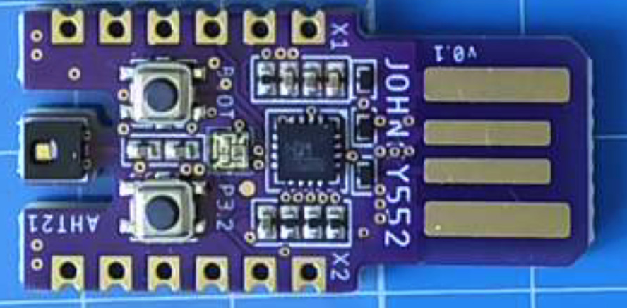
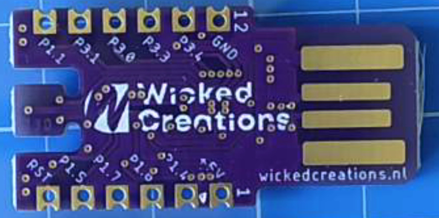

# Johnny552 Hardware Documentation

## Overview

The Johnny552 is a development board based on the CH552 microcontroller, which is part of the CH55x family of USB-capable 8051-core MCUs.

## Hardware Specifications

### CH552 Microcontroller Features
- 12-bit ADC
- 16KB Flash
- USB Device functionality
- Enhanced peripherals

### Development Board Layout

Front View | Back View
:-------------------------:|:-------------------------:
 | 

## Pin Configuration

For the pinout diagram and more details, visit the [Johnny552 IoT Development Board project on Hackaday](https://hackaday.io/project/202773-johnny552-iot-development-board)

### Pin Mapping

Arduino Pin | D Pin | A Pin | Port.Bit | Functions
------------|-------|-------|----------|------------------
PIN01       | -     | -     | -        | VCC (5V)
PIN02       | D5    | A1    | P1.4     | Digital + AIN1
PIN03       | D6    | -     | P1.6     | Digital + U1RX (UART1 Receive)
PIN04       | D7    | -     | P1.7     | Digital + U1TX (UART1 Transmit)
PIN05       | D8    | A2    | P1.5     | Digital + PWM1 + AIN2
PIN07       | D0    | A0    | P1.1     | Digital + AIN0
PIN08       | D1    | -     | P3.1     | Digital + PWM2 + U0TX (UART0 Transmit)
PIN09       | D2    | -     | P3.0     | Digital + PWM1 + U0RX (UART0 Receive)
PIN10       | D3    | -     | P3.3     | Digital + INT1
PIN11       | D4    | -     | P3.4     | Digital + PWM2
PIN12       | -     | -     | -        | GND
PIN32       | D9    | -     | P3.2     | Digital (Tactile Switch) + INT0

The Johnny552 development board exposes the CH552's GPIO pins in an Arduino-compatible layout. The board includes:
- Digital I/O pins
- PWM outputs (PWM1 and PWM2)
- Analog inputs (AIN0, AIN1, and AIN2)
- UART1 serial communication
- USB connectivity
- Power regulation
- Built-in tactile switch on P3.2

## Getting Started with the Hardware

### Installing in Arduino IDE

#### 1. Install CH55x Core
1. Open Arduino IDE
2. Go to `File > Preferences`
3. Add the following URL to the 'Additional Boards Manager URLs' field:
   ```
   https://raw.githubusercontent.com/DeqingSun/ch55xduino/ch55xduino/package_ch55xduino_mcs51_index.json
   ```
4. Go to `Tools > Board > Boards Manager`
5. Search for 'ch55x'
6. Install the 'CH55x MCS51 Boards' package

#### 2. Install Johnny552 Board Support
1. Locate your Arduino hardware folder:
   - Windows: `%USERPROFILE%\Documents\Arduino\hardware`
   - macOS: `~/Documents/Arduino/hardware`
   - Linux: `~/Arduino/hardware`
2. Create a `johnny552` folder inside the hardware folder
3. Clone or copy this repository into that folder
4. The final path should look like:
   ```
   Arduino/hardware/johnny552/ch55xduino/ch55x/variants/ch552/pins_arduino.h
   ```
5. Restart Arduino IDE
6. Select `Tools > Board > Johnny552 Boards > Johnny552`

### Power Supply
The board can be powered through:
- USB connection
- External power supply

### Programming Mode
To upload code to the board:
1. Hold the BOOT button
2. Press RESET
3. Release BOOT
4. Upload your code using the Arduino IDE

## Hardware Interfaces

### USB Interface
- USB Type-C connector
- Supports USB Device mode
- Used for programming and serial communication

### GPIO Pins
- Digital I/O capabilities
- PWM support on selected pins
- Analog input support
- SPI support
- Software I2C support (bit-banging)

## Additional Resources

- [Schematic Diagrams](schematics/)
- [PCB Layout Files](pcb/)
- [Component Datasheets](datasheets/)

## Troubleshooting

### Common Hardware Issues
1. USB Connection Problems
   - Check USB cable connection
   - Verify USB driver installation
   - Ensure proper bootloader mode entry

2. Power Issues
   - Check USB power supply
   - Verify voltage regulator output
   - Check for short circuits

## Safety Considerations

- Do not exceed maximum voltage ratings
- Observe proper polarity when connecting power
- Handle the board with ESD protection
- Keep the board away from moisture and conductive materials